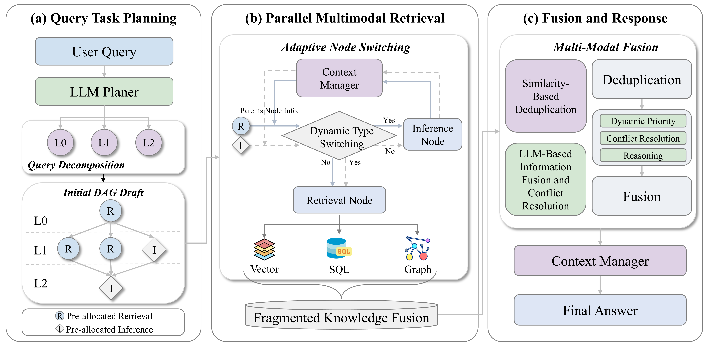
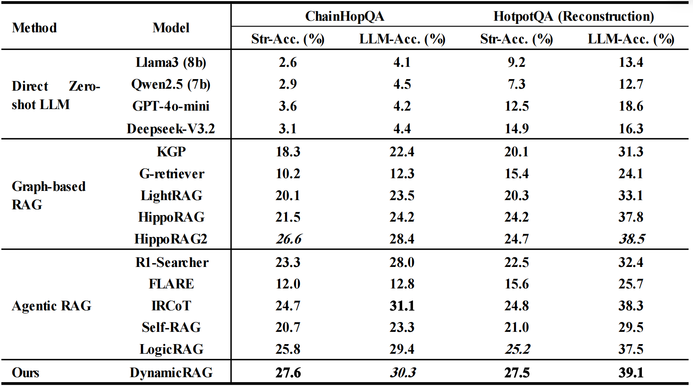
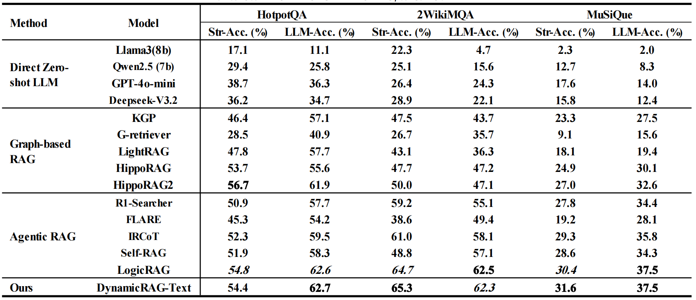
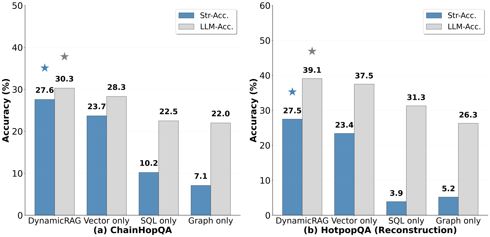
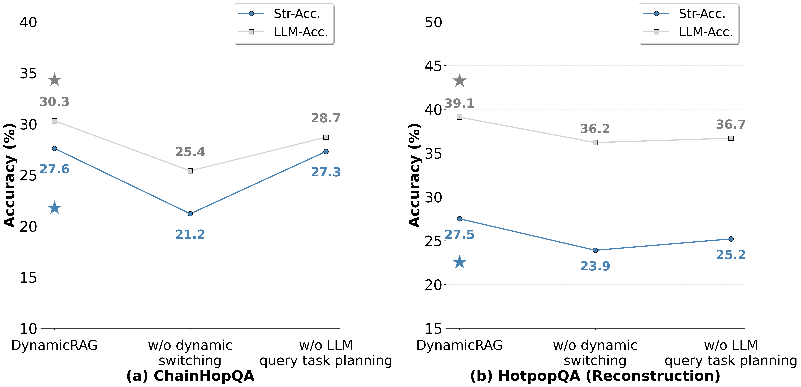

# Triple RAG

**An Industrial-Grade Multi-Source Heterogeneous Data Intelligent Q&A System**

Triple RAG implements complex query decomposition and parallel processing through DAG (Directed Acyclic Graph) orchestration, supporting multi-modal fusion retrieval across structured data (SQLite/MySQL), graph data (Neo4j), and semantic data (Vector DB).
The core codes and data related to the paper have been made open source. Due to time constraints, some parts are still under review and will be made open source as soon as possible.
All the data of the benchmark can be obtained from https://huggingface.co/datasets/oo123123/TripleRAG.

---

## 🌟 Key Features

- **DAG-Based Query Orchestration**: Automatically decomposes complex queries into executable DAG structures with parallel node execution
- **Dynamic Node Type Switching**: Intelligently switches between retrieval and inference modes based on information sufficiency
- **Incremental Retrieval Optimization**: Only queries missing information instead of full retrieval, achieving 50-70% performance improvement
- **Multi-Source Data Fusion**: Seamlessly integrates SQL databases, graph databases, and vector databases
- **Adaptive Optimization**: Smart node skipping and automatic completion checking

---

## 📋 System Requirements

- Python 3.8+
- SQLite (or MySQL)
- Neo4j 3.5+
- ChromaDB
- OpenAI-compatible LLM API (e.g., vLLM, DeepSeek, OpenAI)

---

## 🚀 Quick Start

### 1. Installation

```bash
# Clone the repository
git clone https://github.com/your-org/Triple_RAG.git
cd Triple_RAG

# Install dependencies
pip install -r requirements.txt
```

### 2. Configuration

Update database paths and LLM settings in `config/config.py`:

```python
@dataclass
class LLMConfig:
    base_url: str = 'http://localhost:8000/v1'  # Your LLM service URL
    model: str = 'Qwen2.5-7B-Instruct'

@dataclass
class SQLiteConfig:
    database_path: str = './dataset/sqlite/ChainHopQA.db'  # or ReconHotPotQA.db

@dataclass
class Neo4jConfig:
    uri: str = 'bolt://localhost:7687'
    user: str = 'neo4j'
    password: str = 'your_password'
```

### 3. Prepare Dataset

Due to data size limitations, GitHub only contains the QAPair dataset. The complete benchmark data can be obtained from [https://huggingface.co/datasets/oo123123/TripleRAG](https://huggingface.co/datasets/oo123123/TripleRAG).

**GitHub Repository (Limited)**:
- `dataset/QAPair/` - Question-answer pairs for ChainHopQA and HotpotQA (Reconstruction)
  - ChainHopQA.json, ChainHopQA_full.json
  - ReconHotPotQA.json, ReconHotPotQA_full.json

**Complete Dataset (Hugging Face)**:
- Full multimodal benchmark data organized by benchmark type:
  - **SQLite databases**: ChainHopQA.db, ReconHotPotQA.db
  - **Neo4j graph databases**: ChainHopQA and ReconHotPotQA graph databases
  - **Vector databases**: ChainHopQA and ReconHotPotQA ChromaDB collections
- See `dataset/README.md` for detailed structure and setup instructions

**Required files for full system** (choose your benchmark):
- **ChainHopQA benchmark**:
  - `dataset/sqlite/ChainHopQA.db` - SQLite database
  - `dataset/neo4j/ChainHopQA/` - Neo4j graph database
  - `dataset/vector_db/ChainHopQA/` - ChromaDB collection
- **ReconHotPotQA benchmark**:
  - `dataset/sqlite/ReconHotPotQA.db` - SQLite database  
  - `dataset/neo4j/ReconHotPotQA/` - Neo4j graph database
  - `dataset/vector_db/ReconHotPotQA/` - ChromaDB collection
- `dataset/queries.json` - Input queries (create based on QAPair data)

### 4. Run Batch Processing

```bash
python main.py --input dataset/queries.json --output results.jsonl
```

**Output format** (JSONL):
```json
{"query_id": 0, "question": "...", "system_answer": "...", "status": "success"}
{"query_id": 1, "question": "...", "system_answer": "...", "status": "success"}
```

---

## 🏗️ System Architecture

Triple RAG adopts a 4-layer architecture:



```
┌─────────────────────────────────────────────────────────────┐
│  Layer 1: DAG Orchestration Layer                           │
│  - Query decomposition & DAG generation                     │
│  - Topological sorting & parallel scheduling                │
│  - Adaptive optimization                                    │
└─────────────────────────────────────────────────────────────┘
                            ↓
┌─────────────────────────────────────────────────────────────┐
│  Layer 2: Node Execution Layer                              │
│  - Dynamic node type switching (retrieval ↔ inference)      │
│  - Incremental retrieval optimization                       │
│  - Answer generation & formatting                           │
└─────────────────────────────────────────────────────────────┘
                            ↓
┌─────────────────────────────────────────────────────────────┐
│  Layer 3: Data Fusion Layer                                 │
│  - Multi-modal data fusion & deduplication                  │
│  - Runtime context & memory management                      │
└─────────────────────────────────────────────────────────────┘
                            ↓
┌─────────────────────────────────────────────────────────────┐
│  Layer 4: Storage/Retrieval Layer                           │
│  - SQLite/MySQL adapter                                     │
│  - Neo4j graph adapter                                      │
│  - Vector database retriever (ChromaDB)                     │
└─────────────────────────────────────────────────────────────┘
```

---

## 📂 Project Structure

```
Triple_RAG_main/
├── README.md              # This file
├── LICENSE                # MIT License
├── requirements.txt       # Python dependencies
├── main.py               # Entry point
├── dataset/              # Dataset directory
│   ├── README.md         # Dataset documentation
│   └── QAPair/           # Question-answer pairs
├── config/               # Configuration files
│   ├── config.py         # Main configuration
│   ├── dag_config.yaml   # DAG execution config
│   ├── sql_schema.md     # SQL schema example
│   └── graph_schema.md   # Graph schema example
└── src/                  # Core source code
    ├── core/             # DAG orchestration layer
    ├── retrievers/       # Data retrieval layer
    └── utils/            # Utility functions
```

---

## 🔧 Configuration

### DAG Configuration

Edit `config/dag_config.yaml` to customize DAG execution behavior:

```yaml
dag:
  enabled: true
  max_nodes: 10
  execution:
    max_retry: 3
    node_timeout: 60
    failure_strategy: "stop"
  adaptive_optimizer:
    enabled: true
    skip_enabled: true
    skip_confidence_threshold: 0.7
```

### Database Configuration

Update `config/config.py` with your database credentials and paths.

---

## � Experimental Results

### Triple-Modal Multi-Hop Benchmark Results

As shown in Table 1, the experimental results on the triple-modal multi-hop QA benchmarks demonstrate that TripleRAG achieves the best or second performance across both the ChainHopQA and HotpotQA (Reconstruction) datasets. Specifically, on the Str-Acc metric, TripleRAG attains 27.6% and 27.5% on ChainHopQA and HotpotQA, respectively, outperforming all baseline graph-based and agentic RAG methods. On the LLM-Acc metric, TripleRAG achieves the best result of 39.1% on HotpotQA, while on ChainHopQA it reaches 30.3%, which is second only to IRCoT (31.1%). In conclusion, compared to current leading agentic RAG methods such as IRCoT and LogicRAG, TripleRAG demonstrates more stable overall performance and higher comprehensive accuracy in multimodal scenarios, validating the effectiveness of its dynamic DAG planning and multimodal retrieval fusion mechanisms.



**Table 1**: Triple-modal Multi-Hop Benchmark Results. The Bold and the Underlined numbers indicate the best performance and the second-best performance among all models, respectively.

### Single-Modal Multi-Hop Benchmark Results

To verify the generalizability of TripleRAG's core mechanisms, DynamicRAG is evaluated on single-modality scenarios. As shown in Table 2, DynamicRAG achieves competitive or slightly better performance compared to LogicRAG and HippoRAG2 across three standard multi-hop reasoning benchmarks. This demonstrates that the core mechanisms—node type pre-allocation and dynamic switching—have broad applicability beyond multimodal scenarios, validating their effectiveness as general design principles for RAG systems.



**Table 2**: Single-Modal Multi-Hop Benchmark Results. The Bold and the Underlined numbers indicate the best performance and the second-best performance among all models, respectively.

### Ablation Studies



**Figure 2**: Ablation study on retrieval modalities shows that the full TripleRAG system with multimodal fusion outperforms single-modal approaches by 3.2-3.7 percentage points.



**Figure 3**: Ablation study on core mechanisms demonstrates:
- **Dynamic switching** is crucial: 6.8% Str-Acc drop on ChainHopQA when disabled
- **LLM-based planning** provides moderate benefits
- Full system achieves optimal performance

## �� Core Innovations

### 1. DAG-Based Query Decomposition

Complex queries are automatically decomposed into a DAG structure where:
- Nodes represent sub-queries (retrieval or inference)
- Edges represent dependencies between nodes
- Parallel execution where possible

### 2. Dynamic Node Type Switching

**For Retrieval Nodes**:
- Check if parent information is sufficient
- If YES → Switch to inference mode (skip retrieval)
- If NO → Perform full retrieval

**For Inference Nodes**:
- Check if parent information is sufficient
- If YES → Direct answer generation
- If NO → Switch to retrieval mode with **incremental retrieval**

### 3. Incremental Retrieval

Instead of full retrieval, the system:
1. Identifies information gaps
2. Generates precise queries for missing information
3. Selectively activates retrieval channels (SQL/Graph/Vector)
4. Merges parent info + incremental results

**Benefits**: 50-70% faster, more precise, reduced redundancy

### 4. Multi-Source Data Fusion

Intelligently fuses results from:
- **SQL databases**: Structured transactional data
- **Graph databases**: Entity relationships and knowledge graphs
- **Vector databases**: Semantic document search

### 5. Adaptive Optimization

- **Node Skipping**: Automatically skips redundant retrieval
- **Completion Checking**: Validates final answer completeness
- **Auto-insertion**: Adds nodes if answer is incomplete

---

## 📊 Example Use Cases

### Multi-Hop Reasoning
```
Query: "Compare CATL's and BYD's largest supplier carbon production"

DAG Execution:
Node 1 (retrieval): Query CATL's largest supplier and carbon production
  → Result: "CATL supplier: Company A, carbon: 500 tons"

Node 2 (inference→retrieval): Compare with BYD
  → Incremental retrieval: Only query BYD data
  → Merge: CATL + BYD → Comparison result
```

### Complex Supply Chain Analysis
```
Query: "Which provinces in China have battery companies? What are their main
        supply materials? Do these provinces have supply relationships?"

DAG Execution:
Node 1: Query provinces with battery companies (SQL + Graph)
Node 2: Query main supply materials (SQL)
Node 3: Analyze inter-province supply relationships (Graph)
Node 4: Synthesize final answer (Inference)
```

---

## 🛠️ Development

### Code Structure

- **`src/core/dag_models.py`**: DAG data structures
- **`src/core/query_router.py`**: Query decomposition engine
- **`src/core/dag_executor.py`**: DAG execution engine
- **`src/core/node_agent.py`**: Node execution logic
- **`src/core/fusion_engine.py`**: Multi-source data fusion
- **`src/core/memory.py`**: Context management

### Adding Custom Retrievers

1. Create a new retriever in `src/retrievers/`
2. Implement the `retrieve(query: str) -> List[Dict]` method
3. Register in `src/core/triple_rag.py`

---

## 📝 Citation

If you use Triple RAG in your research, please cite:

```bibtex
@article{triplerag2025,
  title={Triple RAG: An Industrial-Grade Multi-Source Heterogeneous Data Intelligent Q\&A System},
  author={TripleRAG Development Team},
  year={2025}
}
```

---

## 📄 License

This project is licensed under the MIT License - see the [LICENSE](LICENSE) file for details.


